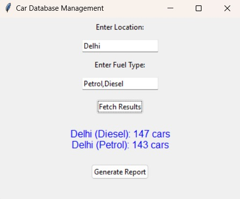
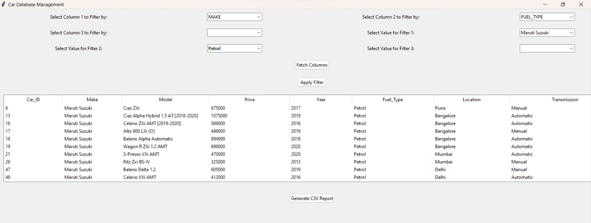

# Features = All chapters

## This branch contains all code and queries related to the chapters.
- [Chapter 1: Preparing Your Relational Schema](#chapter-1-preparing-your-relational-schema)
- [Chapter 2: Security and User Management](#chapter-2-Security-and-User-Management)
- [ Chapter 3: Queries and Optimization](#Chapter-3-Queries-and-Optimization)
- [Chapter 4: Automation of the Information System](#Chapter-4-Automation-of-the-Information-System)
- [Chapter 5: Graphical Interface](#Chapter-5-Graphical-Interface)


## Chapter 1: Preparing Your Relational Schema
- This database schema manages comprehensive information about cars, covering specifications, features, ownership, and dimensions. It includes five tables: CarDetails, CarSpecifications, CarFeatures, CarOwnership, and CarDimensions. 

- [You can see here in details](https://github.com/Krutik-Vanjara/VEHICLE_DATABASE/tree/DATASET)
## Chapter 2: Security and User Management
 **Overview** 
- This section details user and role management in the car management system, ensuring appropriate access levels to database tables for different users. The system accommodates three user types: admin, manager, and regular users, each with distinct roles and permissions.
 **Users and Roles**  
**1.Admin User (C##admin_user)**
  **Role:** C##admin_role  
  **Permissions:** Full access to all tables (CarDetails, CarSpecifications, CarFeatures, CarOwnership, CarDimensions).  
**2.Manager User (C##manager_user)**  
  **Role:** C##manager_role  
  **Permissions:** Modify access (read, insert, update) to all tables, with no Data Definition Language (DDL) permissions.  
**3.Regular User (C##regular_user)**  
  **Role:** C##regular_role  
  **Permissions:** Read-only access to all tables.  
**Role Creation and Privileges**  
  **Admin Role (C##admin_role):** Full access to all tables.  
  **Manager Role (C##manager_role):** Select, insert, and update privileges on all tables.  
  **Regular Role (C##regular_role):** Select privileges on all tables.  
**Assigning Roles to Users**  
  C##admin_role is assigned to C##admin_user.  
  C##manager_role is assigned to C##manager_user.  
  C##regular_role is assigned to C##regular_user.  
**Password Policy**  
  The default profile is modified to set a 90-day password lifetime, requiring periodic password changes.  
**Views for Restricted Access**  
A view, CarDetails_View, is created to limit access to specific columns (Car_ID, Make, Model) for users with the C##regular_role, ensuring the underlying table remains secure by restricting access to other columns.
## Chapter 3: Queries and Optimization
**Overview**
This section presents SQL queries to retrieve and analyze data from the car management system, including car listings with specifications, average price calculations, price rankings, and query performance optimization.
## Chapter 4: Automation of the Information System
**Overview**
-This section describes the triggers, functions, and procedures implemented to manage and automate various operations within the car management system. These include logging deletions, restricting user actions, calculating total car values, updating car prices, and counting cars based on specific criteria.
**Triggers**
-Trigger to Print Message on New Record Insertion
## Chapter 5: Graphical Interface

 - [Gui1](Bonus.py)This GUI application combines Python's cx_Oracle library with Tkinter to manage a car database. Users can input multiple locations and fuel types, retrieve the count of cars matching their criteria, and view the results in an intuitive interface. It also offers a feature to generate and save detailed reports as CSV files, utilizing Oracle SQL for dynamic data retrieval and visualization.
- [GUI2](gui_system.py) The Car Database Management System is a Tkinter-based GUI application for managing and filtering car details stored in an Oracle database. It features a user-friendly interface that allows users to dynamically select up to three columns for data filtering, with column names sourced directly from the database schema. Upon selection, the application retrieves and displays distinct values in dropdown menus for precise filtering. Results are shown in a table, supported by dynamically constructed SQL queries. Users can also export the filtered data as a CSV file for further analysis or sharing. Utilizing the cx_Oracle library for database connectivity, the system ensures smooth interaction with the Oracle database. Designed for car inventory management, the GUI simplifies complex filtering and data management processes, making it accessible to users without SQL expertise. With real-time query construction, dynamic value fetching, and CSV export, this application offers an efficient and intuitive solution for managing car records.
## To run this GUI, first install the dependencies:

## Installation Instructions

To install the required dependencies, run the following command in your terminal:

```python
pip install tkinter cx_Oracle csv python3
```

-  Clone these two files:
-  (# [gui_system.py](gui_system.py))
-  (# [Bonus](Bonus.py))

## GUI SCREENSHOOTS


